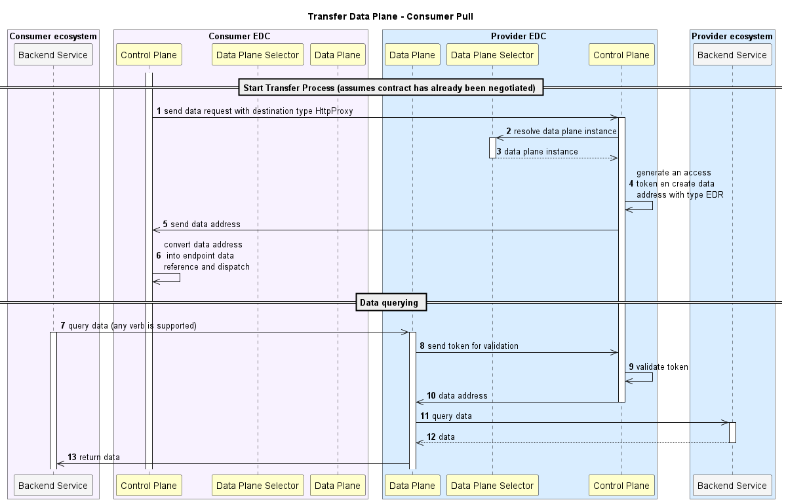

# Data Transfer

## Data Flows Supported by the EDC

- Consumer pull
- Provider push

### Consumer pull

1. Provider and consumer agree to a contract (not displayed in the diagram)
2. Consumer initiates the transfer process by sending a `DataRequest` with destination type `HttpProxy`
3. Provider Data Plane Selector is queried to find a suitable instance
4. Provider Control Plane build a `DataAddress` which type `EDR`, whose:
    - endpoint corresponds to the public API of the selected Data Plane
    - auth key is `Authorization`
    - auth code is a signed token generated by the Control Plane with claims:
    - `dad` containing the encrypted `DataAddress` of the actual data source (provider ecosystem)
    - `cid` claim containing the contract id
5. This `DataAddress` is sent to the consumer Control Plane through DSP protocol
6. Consumer Control Plane converts the `DataAddress` into a `EndpointDataReference` object and dispatch it through the `EndpointDataReferenceReceiverRegistry`

Once this process is completed, the consumer backend applications can use the received `EndpointDataReference` in order
to query data from the provider Data Plane, by simply providing the provided token in the request header.

> **_NOTE:_**  For a Data Plane instance to be eligible for the Consumer Pull transfer, it must:
>  - contains `HttpProxy` in the `allowedDestTypes`
>  - contain a `property` which key `publicApiUrl`, which contains the actual URL of the Data Plane public API.

#### Use Case

Provider wants to expose a Rest API taking as input some query parameters that restrict the amount of data returned for each query.
Here it is not feasible for the data consumer to negotiate a contract for each query that will hit the provider data source API.
Here the approach for the consumer would then be to
[negotiate with the provider the possibility to access the data source through a proxy](../../extensions/control-plane/transfer/transfer-data-plane/README.md).
If the negotiation ends successfully, the consumer will be provided an access token that its backend applications can then use when querying the Data Plane public API.

This approach enables the consumer backend application to pass directly the query parameters, path parameters and body
in the request to the [Data Plane Public API](../../extensions/data-plane/data-plane-public-api/README.md). If the provider data source allows it, these parameters will then be conveyed until the data source.

### Provider push

1. Provider and consumer agree to a contract (not displayed in the diagram)
2. Consumer initiates the transfer process, i.e. sends `DataRequest` with any destination type other than `HttpProxy`
3. Provider Control Plane retrieves the `DataAddress` of the actual data source and creates a `DataFlowRequest` based on the received `DataRequest` and this data address
4. Provider Control Plane asks the selector which Data Plane instance can be used for this data transfer
5. Selector returns an eligible Data Plane instance (if any)
6. Provider Control Plane sends the `DataFlowRequest` to the selected Data Plane instance through its control API (see `DataPlaneControlApi`)
7. Provider Data Plane validates the incoming request
8. If request is valid, Provider Data Plane returns acknowledgement
9. `DataPlaneManager` of the Provider Data Plane processes the request: it creates a `DataSource`/`DataSink` pair based on the source/destination data addresses
10. Provider Data Plane fetches data from the actual data source (see `DataSource`)
11. Provider Data Plane pushes data to the consumer services (see `DataSink`)

#### Use Case

Provider exposes some data located in a Cloud storage, such as AWS S3 or Azure storage. Consumer wants to copy these data
into its own storage system (which can be of a different type than the one of the provider). Here the consumer will negotiate a
_simple_ data transfer, by notifying to which location the data should be copied. Once contract is agreed between both parties,
the provider will automatically trigger the data transfer by delegating the data copy to is Data Plane system, through its Control API.

## Transfer Process State Machine

Description:
- Provider lists supported protocols and flows (e.g., HTTP push) as part of the initial contract offer. TBD which IDS message property can be used.

Subsequently, a contract negotiation (not depicted here) is performed.
